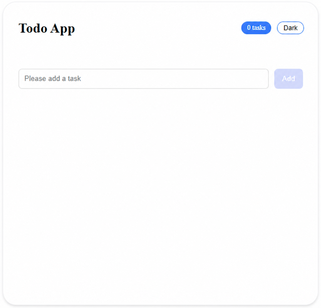
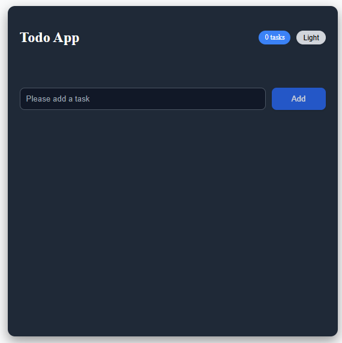

# 📝 React Todo App

## 🌐 Live Demo

https://react-todo-app-ecru-eta.vercel.app

A clean and responsive Todo application built with React.  
It includes filtering, search, dark mode, LocalStorage persistence, inline editing, and validation.

## 📸 Screenshots

### ☀️ Light Mode



### 🌙 Dark Mode



## 🚀 Features

- Add, edit, and delete todos
- Prevent duplicate tasks
- Mark todos as complete or undo
- Filter todos (All / Active / Completed)
- Search functionality
- Dark mode toggle
- Persist todos, filters, and theme using LocalStorage
- Clear completed todos
- Auto-focus input while editing
- Disable Add button when input is empty
- Responsive UI design
- Error handling for invalid input and duplicates

## 🛠️ Tech Stack

- React
- JavaScript (ES6+)
- React Hooks (useState, useEffect, useRef)
- CSS
- LocalStorage API

## 📚 What I Practiced

- State management with React Hooks
- Controlled components
- Conditional rendering
- Form validation and error handling
- Array methods (map, filter, some)
- Persisting data with LocalStorage
- Managing focus with useRef
- Responsive design with CSS
- Dark mode implementation

## 📦 Installation

```bash
git clone https://github.com/ydondar/react-git-practice.git
cd react-git-practice
npm install
npm run dev
